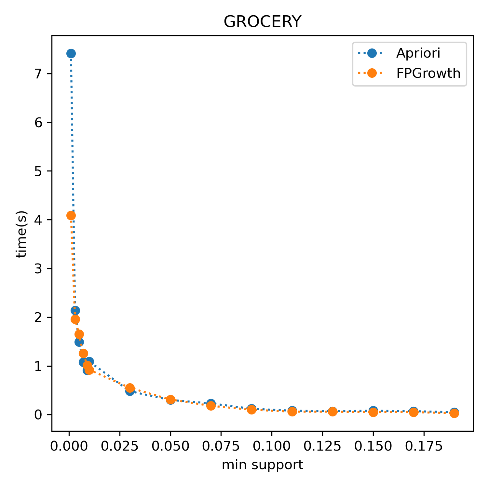
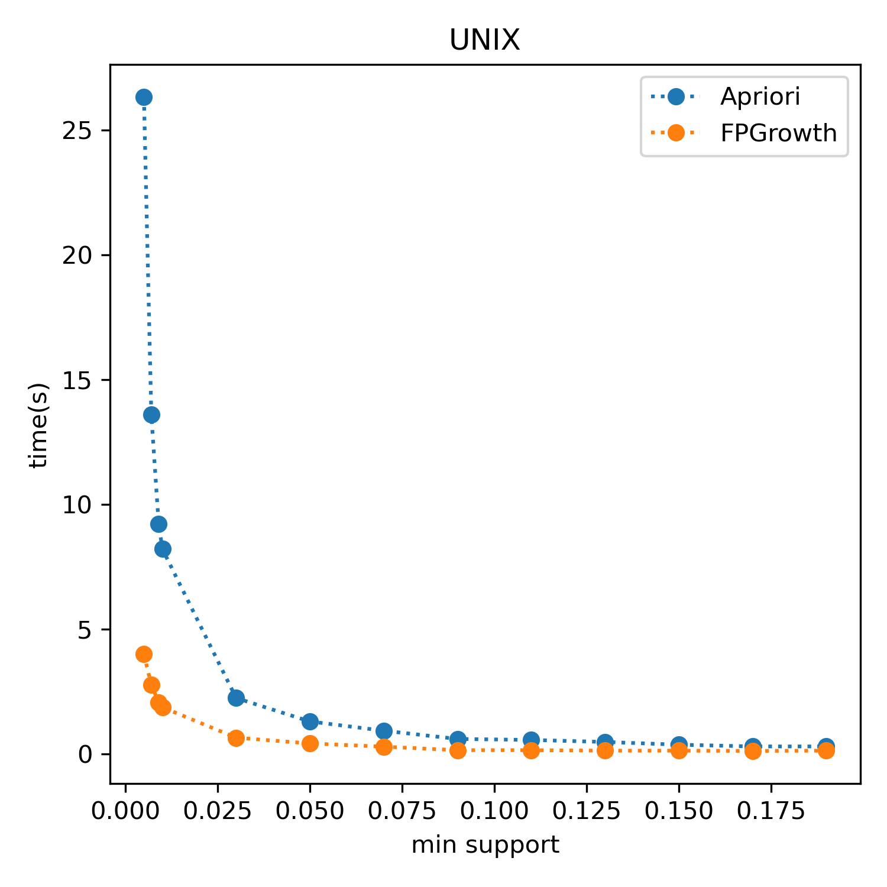

# Association Rules Minning Using Python

Implementation of association rules minning algorithms(**Apriori**|**FPGrowth**) using python. As a part of hw1 code in NJU class.

## Usage

You can calculate the frequent items and mining the rules using clean code:

```python
from datasets import DataReader
from algorithms import Itemmining
data = DataReader("GROCERY")
item_mining = Itemmining(da)
item_mining.get_frequent_items(min_sup=0.01, "Apriori")
item_mining.get_rules(min_con=0.5)
rules = item_mining.get_top_rules(50) 
```

If you want to try new dataset, you only need to put your data in folder `datasets` and modify `datasets/data_reader.py`.

## Some Result(NO CODE)



